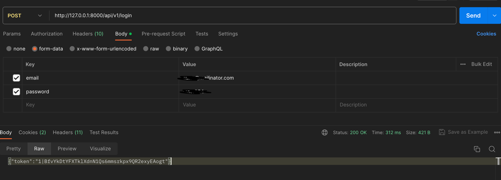
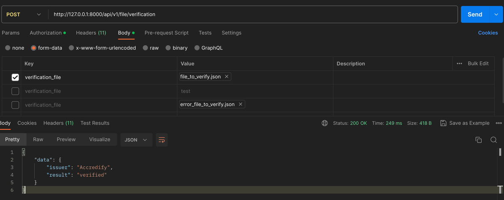
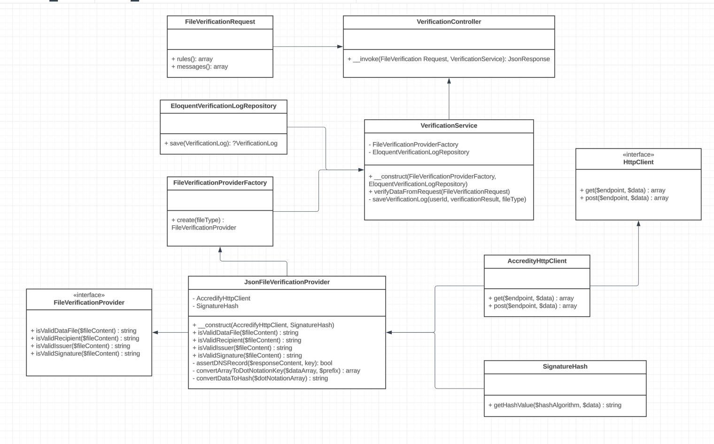

# API Documentation

## Table of Contents

- [User Creation and Token Generation](#user-creation-and-token-generation)
- [Accessing Verification Portal](#accessing-verification-portal)
- [High Level UML Diagram](#high-level-uml-diagram)

## User Creation and Token Generation

1. After run the application, use the following command to add users:


   ```bash
   php artisan user:create {Username} {email} {password}
   ```
NB: replace {Username} {email} {password} with your credentials

2. After user creation step, use the following route to generate token by providing your email and password from previous step:

    ```
   Endpoint: http://127.0.0.1:8000/api/v1/login
   Method: POST
   Response Body: refer to the screenshot sample
   ```



   
## Accessing Verification Portal

1. After getting token from previous steps to access protected routes, set the token value under Authorization->Bearer Token(Type)->Token

    ```
   Endpoint: http://127.0.0.1:8000/api/v1/file/verification
   Method: POST
   Form-data: verification_file (only accept json files)
   Possible Status codes: 200, 401, 422, 500
   Response Body: refer to the screenshot sample below
   ```



## High Level UML Diagram


